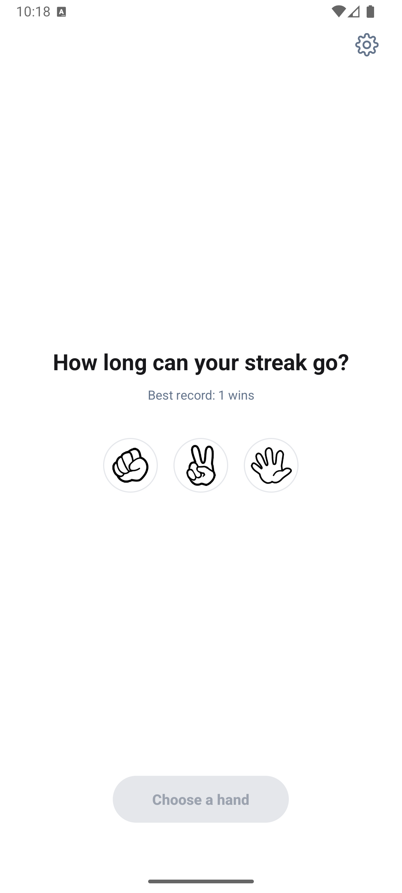
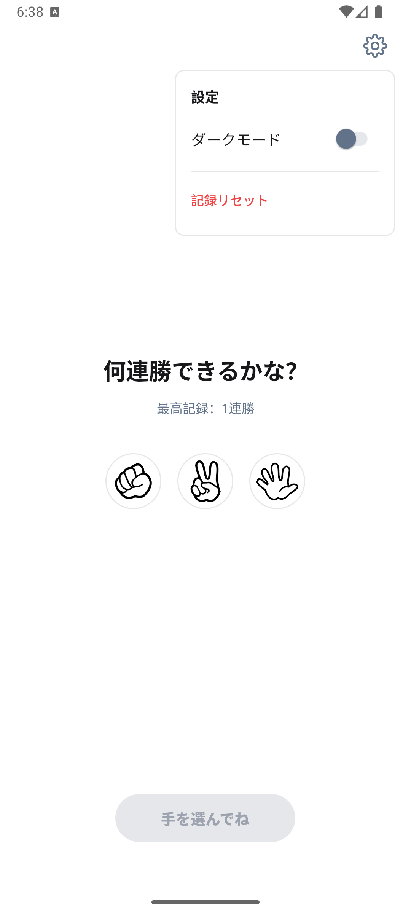
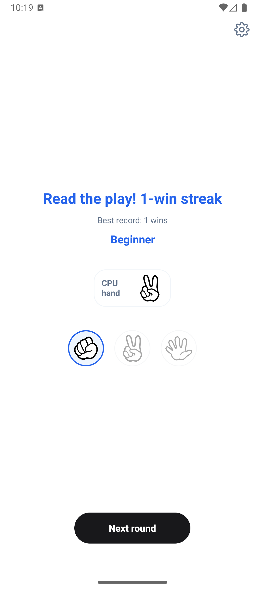

# RPS Streak

## Screenshots

  
  
  

## English

RPS Streak is a simple Android Rock Paper Scissors game.

The app focuses on a clean UI and a smooth game rhythm. Players choose a hand, start the match, watch the "jan-ken-pon" countdown, and then see the CPU hand and result.

### Features

- Rock Paper Scissors gameplay against the CPU
- Win streak and best streak record
- Streak titles such as Beginner, Janken Master, and God's Hand
- Result animations for win, lose, and draw
- Countdown sound effects and result sound feedback
- Dark mode setting
- Best record reset with confirmation

### Tech Stack

- Platform: Android
- Language: Java
- Local Storage: SharedPreferences
- Build Tool: Gradle

### How to Run

Open the project in Android Studio and run the app on an emulator or Android device.

---

## 日本語

RPS Streak は、Android 向けのシンプルなじゃんけんゲームです。

きれいで見やすい UI と、テンポの良いゲーム体験を意識して作りました。手を選んで「勝負！」を押すと、「じゃん・けん・ぽん！」のカウントダウン後に CPU の手と結果が表示されます。

### 主な機能

- CPU と対戦するじゃんけんゲーム
- 連勝数と最高記録の保存
- 「初心者」「じゃんけん名人」「神の手」などの連勝称号
- 勝ち・負け・引き分けごとの結果アニメーション
- カウントダウン音と結果音のフィードバック
- ダークモード切り替え
- 確認ダイアログ付きの記録リセット

### 使用技術

- プラットフォーム：Android
- 開発言語：Java
- ローカル保存：SharedPreferences
- ビルドツール：Gradle

### 実行方法

Android Studio でプロジェクトを開き、エミュレーターまたは Android 端末で実行してください。

---

## 繁體中文

RPS Streak 是一個簡單的 Android 剪刀石頭布遊戲。

這個專案重點放在簡潔的 UI 和順暢的遊戲節奏。玩家選擇手勢後按下「勝負！」，畫面會依序顯示「じゃん・けん・ぽん！」倒數，接著揭曉 CPU 出手與勝負結果。

### 主要功能

- 與 CPU 對戰的剪刀石頭布玩法
- 連勝數與最高連勝紀錄
- 「初心者」「じゃんけん名人」「神の手」等連勝稱號
- 勝利、失敗、平手的結果動畫
- 倒數音效與結果音效回饋
- 深色模式切換
- 具確認視窗的最高紀錄重置功能

### 使用技術

- 平台：Android
- 開發語言：Java
- 本地儲存：SharedPreferences
- 建置工具：Gradle

### 執行方式

使用 Android Studio 開啟此專案，並在模擬器或 Android 裝置上執行。
